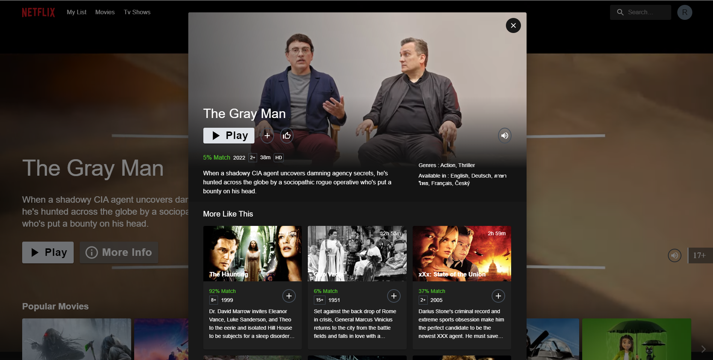
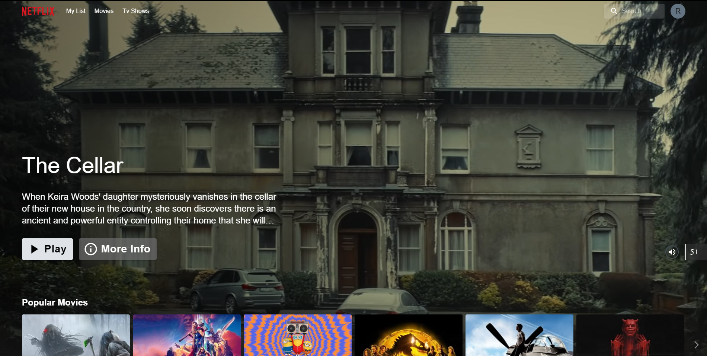
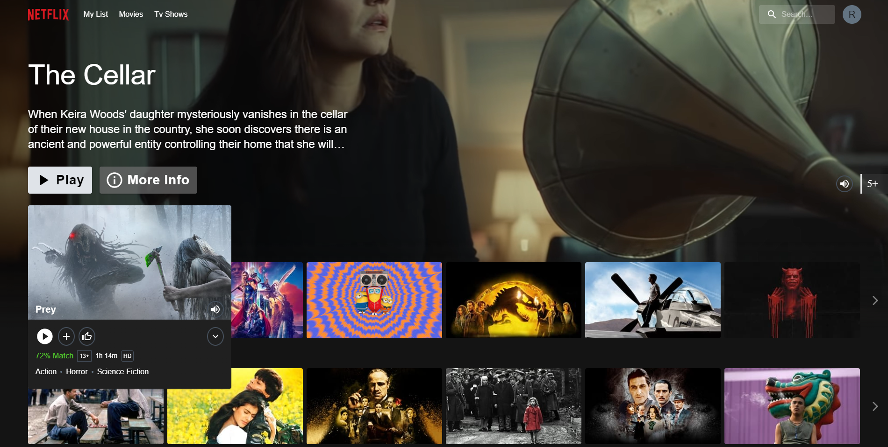
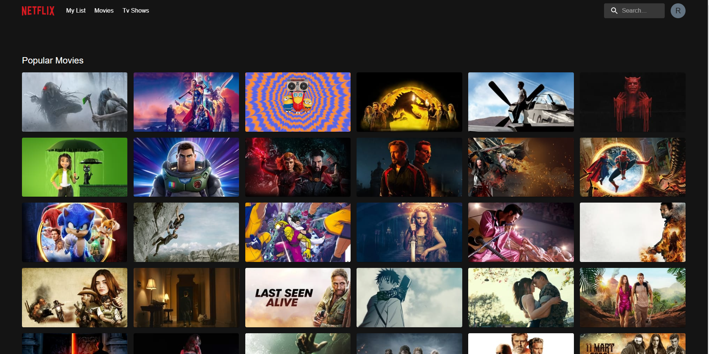

<br />
<br />
<hr />
<div align="center">
  <a href="http://netflix-clone-with-tmdb-using-react-mui.vercel.app/">
    
  </a>

  <h3 align="center">Netflix Clone</h3>

  <p align="center">
    <a href="http://netflix-clone-with-tmdb-using-react-mui.vercel.app/">View Demo</a>
    ·
    <a href="https://www.youtube.com/watch?v=eRL0r3GEDiw">YouTube</a>
    ·
    <a href="https://github.com/endo-aki22/netflix-clone-with-tmdb-using-react-mui/issues">Report Bug</a>
    ·
    <a href="https://github.com/endo-aki22/netflix-clone-with-tmdb-using-react-mui/issues">Request Feature</a>
  </p>
</div>

<details>
  <summary>Table of Contents</summary>
  <ol>
    <li>
      <a href="#prerequests">Prerequests</a>
    </li>
    <li>
      <a href="#which-features-this-project-deals-with">Which features this project deals with</a>
    </li>
    <li><a href="#third-party-libraries-used-except-for-react-and-rtk">Third Party libraries used except for React and RTK</a></li>
    <li>
      <a href="#contact">Contact</a>
    </li>
  </ol>
</details>

<br />

<div align="center">
  
  <p align="center">Home Page</p>
  
  <p align="center">Mini Portal</p>
  
  <p align="center">Detail Modal</p>
  
  <p align="center">Grid Genre Page</p>
</div>

## Prerequests

- Create an account if you don't have on [TMDB](https://www.themoviedb.org/).
  Because I use its free API to consume movie/tv data.
- And then follow the [documentation](https://developers.themoviedb.org/3/getting-started/introduction) to create API Key
- Finally, if you use v3 of TMDB API, create a file named `.env`, and copy and paste the content of `.env.example`.
  And then paste the API Key you just created.

## Which features this project deal with

- How to create and use [Custom Hooks](https://reactjs.org/docs/hooks-custom.html)
- How to use [Context](https://reactjs.org/docs/context.html) and its provider
- How to use lazy and Suspense for [Code-Splitting](https://reactjs.org/docs/code-splitting.html)
- How to use [Portal](https://reactjs.org/docs/portals.html)
- How to use [Fowarding Refs](https://reactjs.org/docs/forwarding-refs.html) to make components reusuable
- How to create and use [HOC](https://reactjs.org/docs/higher-order-components.html)
- How to customize default theme of [MUI](https://mui.com/)
- How to use [RTK](https://redux-toolkit.js.org/introduction/getting-started)
- How to use [RTK Query](https://redux-toolkit.js.org/rtk-query/overview)
- How to customize default classname of [MUI](https://mui.com/material-ui/experimental-api/classname-generator).
- Infinite Scrolling(using [Intersection Observer API](https://developer.mozilla.org/en-US/docs/Web/API/Intersection_Observer_API))
- How to make awesome carousel using [slick-carousel](https://react-slick.neostack.com)

## Third Party libraries used except for React and RTK

- [MUI(Material UI)](https://mui.com/)
- [framer-motion](https://www.framer.com/docs/)
- [react-player](https://github.com/CookPete/react-player)
- [react-use](https://github.com/streamich/react-use)
- [react-slick](https://react-slick.neostack.com/)

## Install with Docker

```sh
docker build --build-arg TMDB_V3_API_KEY=your_api_key_here -t netflix-clone .

docker run --name netflix-clone-website --rm -d -p 80:80 netflix-clone
```

## Todo

- Implement animation using motion hook from `react-use`, now I am using `framer-motion` for animation. If we use the motion hook from `react-use`, `framer-motion` is not needed.
- Improve performance. I am using `context` and `provider` but all components subscribed to the context's value are re-rendered. These re-renders happen even if the part of the value is not used in render of the component. there are [several ways](https://blog.axlight.com/posts/4-options-to-prevent-extra-rerenders-with-react-context/) to prevent the re-renders from these behaviours. In addition to them, there may be several performance issues.
- Replace bundler([Vite](https://vitejs.dev/guide)) with [Turbopack](https://turbo.build/pack/docs/why-turbopack). Turbopack is introduced in Next.js conf recently. It's very fast but it's nor ready to use right now. it just support Next.js, and they plan to support all others as soon as possible. so if it's ready to use, replace [Vite](https://vitejs.dev/guide) with [Turbopack](https://turbo.build/pack/docs/why-turbopack).

## Contact

- endo_aki22@outlook.com
- [Linkedin](https://www.linkedin.com/in/endo-aki-63b8791a6/)

> **Note**
> There might be several things to improve for performance.
> Because this project only aims to show how to use the features mentioned above.
> So I welcome anyone who wants to contribute.
> If there are anyone who wants to contribute, there are some points(animation using `react-use`, not `framer-motion`, and fix position of the portal in Grid page)
